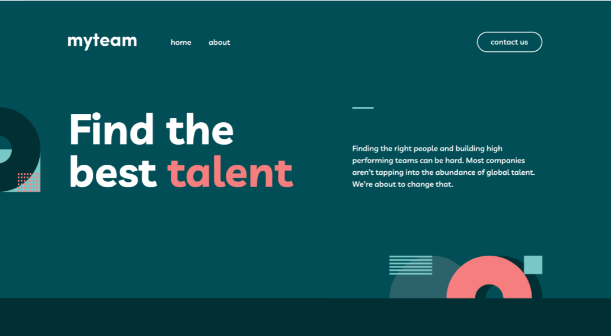
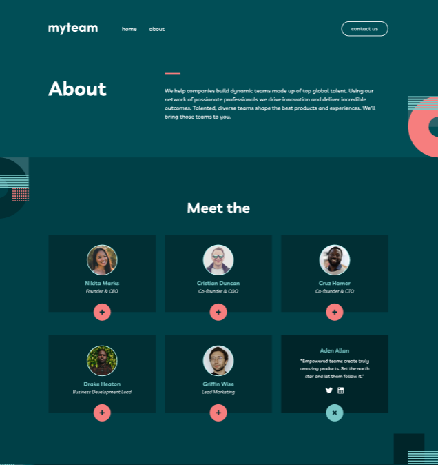
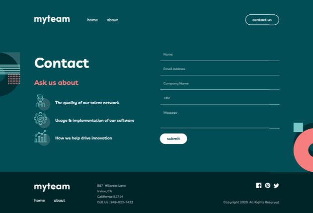
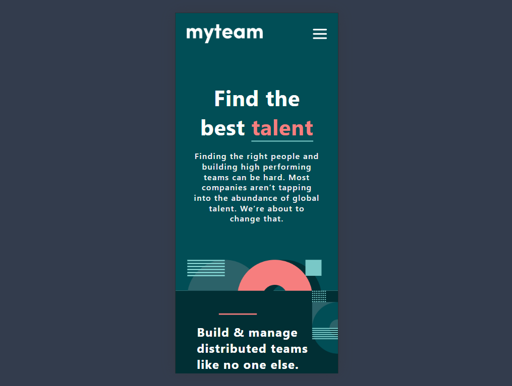
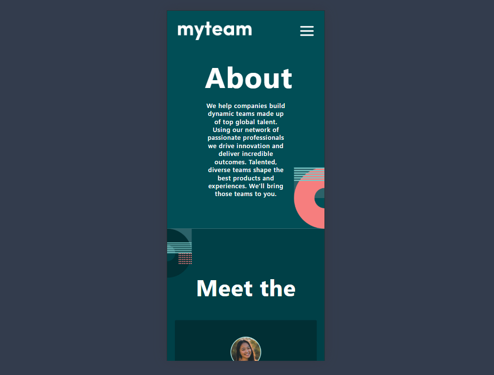
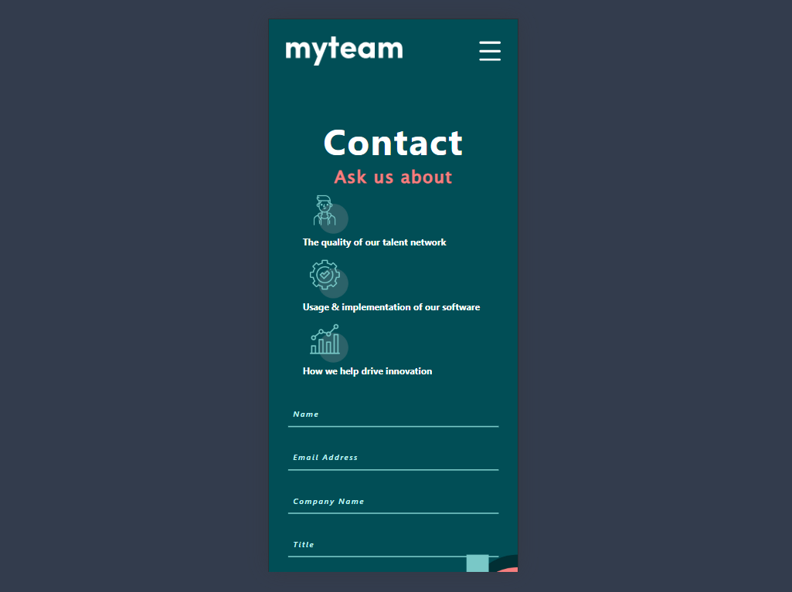

# MyTeam-Website

This project is a Frontend design version of the "MyTeam Website" website. The site provides users with the opportunity to find the best team, get information about the company and contact them.

---

# 🖼️ Screenshots

## 💻 Desktop version:

---

---

---

## 📱 Mobile version:

---

---

---

# 📌 Features

✅ **Responsive design** - The site adapts to all screen sizes (desktop, tablet and mobile devices).

✅ **Multi-page structure** - Includes home, team, and contact pages.

✅ **Interactive UI** - Allows you to open additional information about team members.

✅ **Contact form** - Allows users to contact you directly.

---

# 📂 Project structure

#### myteam-multi-page-website

```
│── index.html # Home page
│── about.html # About the team page
│── contact.html # Contact page
│── assets/
│ ├── css/
│ │ ├── style.css # Basic styles
│ │ ├── responsive.css # Mobile compatibility
│ ├── images/ # Images on the site
│ ├── js/
```

---

# 📲 Mobile compatibility

The site is based on a **mobile-first** design and supports the following screen sizes:

📱 **Mobile** (375px - 767px)

📟 **Tablet** (768px - 1024px)

🖥 **Desktop** (1025px and larger)

---

## 🔧 Launch

To launch the project on a local server, follow these steps do:

### 🔻 Download project:
```bash
git clone https://github.com/Faridun11/myteam-multi-page-website.git
```

### 📂 Open project:
```bash
https://myteamuz.vercel.app/
```

### 🌐 Open in browser:
Open the index.html file in the browser.
```
https://myteamuz.vercel.app/
```
